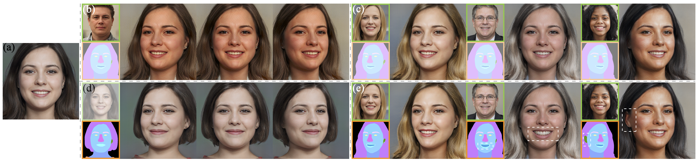

## Towards High-Quality and Disentangled Face Editing in a 3D GAN<br><sub>Official PyTorch implementation of the TPAMI 2025 Journal paper</sub>



**Towards High-Quality and Disentangled Face Editing in a 3D GAN**<br>
Kaiwen Jiang, Shu-Yu Chen, Feng-Lin Liu, Hongbo Fu, Lin Gao<br>

Abstract: *Recent methods for synthesizing 3D-aware face images have achieved rapid development thanks to neural radiance fields, allowing for high quality and fast inference speed. However, existing solutions for editing facial geometry and appearance independently usually require retraining and are not optimized for the recent work of generation, thus tending to lag behind the generation process. To address these issues, we introduce NeRFFaceEditing, which enables editing and decoupling geometry and appearance in the pretrained tri-plane-based neural radiance field while retaining its high quality and fast inference speed. Our key idea for disentanglement is to use the statistics of the tri-plane to represent the high-level appearance of its corresponding facial volume. Moreover, we leverage a generated 3D-continuous semantic mask as an intermediary for geometry editing. We devise a geometry decoder (whose output is unchanged when the appearance changes) and an appearance decoder. The geometry decoder aligns the original facial volume with the semantic mask volume. We also enhance the disentanglement by explicitly regularizing rendered images with the same appearance but different geometry to be similar in terms of color distribution for each facial component separately. Our method allows users to edit via semantic masks with decoupled control of geometry and appearance. Both qualitative and quantitative evaluations show the superior geometry and appearance control abilities of our method compared to existing and alternative solutions.*

[Project Page](http://geometrylearning.com/NeRFFaceEditing/) | [Paper](https://ieeexplore.ieee.org/document/10829803)

**&#9733;&#9733;&#9733; NEW: This is the updated version of NeRFFaceEditing on the official EG3D. Certain training strategies are modified. Please see the paper for more details. &#9733;&#9733;&#9733;**

## Requirements
* The code is tested only on the Linux platform. For training, please use 4+ high-end NVIDIA GPUs. For evaluation, 1 high-end NVIDIA GPU is enough.
* 64-bit Python 3.9 and PyTorch 1.11.0 (or later). See https://pytorch.org for PyTorch install instructions.
* CUDA toolkit 11.3 or later.
* Environment setup commands:
```shell
$ conda env create -f environment.yml
$ conda activate eg3d
$ python -m ipykernel install --user --name=eg3d
```

## Getting started
Please download the pre-trained checkpoint from [link](https://drive.google.com/file/d/1JuqQUTx5fiT0-XUWSGlSofI4Kb5ytq_4/view?usp=sharing) and put it under `./networks/`.

If you would like to train the model from scratch, please:
- Download the `ffhqrebalanced512-64.pkl` from the official [EG3D](https://github.com/NVlabs/eg3d), and put it under `./networks`.
- Download the `79999_iter.pth` from the [link](https://drive.google.com/open?id=154JgKpzCPW82qINcVieuPH3fZ2e0P812), and put it under `./external_dependencies/face_parsing/`.

## Generating media

We provide a notebook `demo.ipynb` to demonstrate the editing and style-transfer ability of NeRFFaceEditing.

## Preparing datasets

Please resort to the official [EG3D](https://github.com/NVlabs/eg3d) about how to process the dataset. We use the recropped FFHQ dataset without further modifications as in EG3D.

## Training

Please remember to modify certain **paths** before training.

You can train the model with 4 Tesla V100 GPU by the following command:
```shell
$ conda activate eg3d && chmod +x ./start.sh
$ ./start.sh
```

## Citation
```
@ARTICLE{10829803,
  author={Jiang, Kaiwen and Chen, Shu-Yu and Liu, Feng-Lin and Fu, Hongbo and Gao, Lin},
  journal={IEEE Transactions on Pattern Analysis and Machine Intelligence}, 
  title={Towards High-Quality and Disentangled Face Editing in a 3D GAN}, 
  year={2025},
  volume={},
  number={},
  pages={1-12},
  keywords={Geometry;Decoding;Semantics;Image color analysis;Three-dimensional displays;Faces;Training;Neural radiance field;Codes;Rendering (computer graphics);Face editing;neural radiance fields;neural rendering;semantic-mask-based interfaces;volume disentangling},
  doi={10.1109/TPAMI.2024.3523422}
}
```

## Acknowledgements
Part of the codes are borrowed from [EG3D](https://github.com/NVlabs/eg3d), and [face-parsing.PyTorch](https://github.com/zllrunning/face-parsing.PyTorch).
